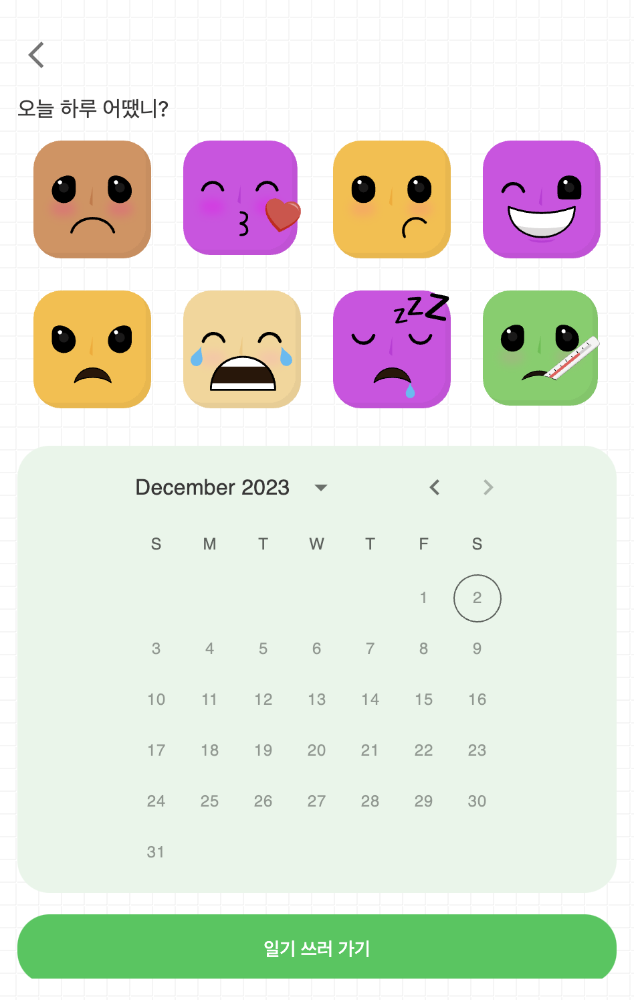

<div align="center">

  
  <h1>Emotions Diary</h1>
</div>

<!-- Table of Contents -->

# 📔 Table of Contents

- [About the Project](#🌟-about-the-project)
  - [Screenshots](#📷-screenshots)
  - [Tech Stack](#👾-tech-stack)
  - [Features](#🎯-features)
  - [Color Reference](#🎨-color-reference)
  <!-- - [Environment Variables](#key-environment-variables) -->
- [Getting Started](#🧰-getting-started)
  - [Prerequisites](#🚨-prerequisites)
  - [Installation](#⚙️-installation)
  - [Run Locally](#🏃-run-locally)
    <!-- - [Running Tests](#test_tube-running-tests) -->
    <!-- - [Deployment](#triangular_flag_on_post-deployment) -->
- [Usage](#👀-usage)
  <!-- - [Roadmap](#compass-roadmap) -->
  <!-- - [Contributing](#wave-contributing) -->
    <!-- - [Code of Conduct](#scroll-code-of-conduct) -->
  <!-- - [FAQ](#grey_question-faq) -->
  <!-- - [License](#warning-license) -->
- [Contact](#🤝-contact)
- [Acknowledgements](#💎-acknowledgements)

<!-- About the Project -->

## 🌟 About the Project

<!-- Screenshots -->

### 📷 Screenshots

<div align="center"> 
  
</div>

<!-- TechStack -->

### 👾 Tech Stack

<details>
  <summary>Client</summary>
  <ul>
    <li><a href="https://www.typescriptlang.org/">Typescript</a></li>
    <li><a href="https://reactjs.org/">React.js</a></li>
    <li><a href="https://tailwindcss.com/">TailwindCSS</a></li>
  </ul>
</details>

<!-- <details>
  <summary>Server</summary>
  <ul>
    <li><a href="https://www.typescriptlang.org/">Typescript</a></li>
    <li><a href="https://expressjs.com/">Express.js</a></li>
    <li><a href="https://go.dev/">Golang</a></li>
    <li><a href="https://nestjs.com/">Nest.js</a></li>
    <li><a href="https://socket.io/">SocketIO</a></li>
    <li><a href="https://www.prisma.io/">Prisma</a></li>
    <li><a href="https://www.apollographql.com/">Apollo</a></li>
    <li><a href="https://graphql.org/">GraphQL</a></li>
  </ul>
</details>

<details>
<summary>Database</summary>
  <ul>
    <li><a href="https://www.mysql.com/">MySQL</a></li>
    <li><a href="https://www.postgresql.org/">PostgreSQL</a></li>
    <li><a href="https://redis.io/">Redis</a></li>
    <li><a href="https://neo4j.com/">Neo4j</a></li>
    <li><a href="https://www.mongodb.com/">MongoDB</a></li>
  </ul>
</details>

<details>
<summary>DevOps</summary>
  <ul>
    <li><a href="https://www.docker.com/">Docker</a></li>
    <li><a href="https://www.jenkins.io/">Jenkins</a></li>
    <li><a href="https://circleci.com/">CircleCLI</a></li>
  </ul>
</details> -->

<!-- Features -->

### 🎯 Features

- 날짜와 감정을 선택하여 그날의 감정에 따라 일기를 적어 로컬에 저장할 수 있습니다.
- 일기를 수정하고 삭제할 수 있습니다.

<!-- Color Reference -->

### 🎨 Color Reference

| Color           | Hex                                                              |
| --------------- | ---------------------------------------------------------------- |
| Primary Color   |  #383737 |
| Secondary Color |  #00FF00 |
| Accent Color    |  #E8F5E9 |
| Text Color      |  #EEEEEE |

<!-- Env Variables -->

<!-- ### 🔑 Environment Variables

To run this project, you will need to add the following environment variables to your .env file

`API_KEY`

`ANOTHER_API_KEY` -->

<!-- Getting Started -->

## 🧰 Getting Started

<!-- Prerequisites -->

### 🚨 Prerequisites

This project uses Yarn as package manager

```bash
 npm install --global yarn
```

<!-- Installation -->

### ⚙️ Installation

Install my-project with npm

```bash
  yarn install my-project
  cd my-project
```

<!-- Running Tests -->

<!-- ### 🧪 Running Tests

To run tests, run the following command

```bash
  yarn test test
``` -->

<!-- Run Locally -->

### 🏃 Run Locally

Clone the project

```bash
  git clone https://github.com/ssseok/EmotionsDiary.git
```

Go to the project directory

```bash
  cd my-project
```

Install dependencies

```bash
  yarn install
```

Start the server

```bash
  yarn start
```

<!-- Deployment -->

<!-- ### 🚩 Deployment

To deploy this project run

```bash
  yarn deploy
``` -->

<!-- Usage -->

## 👀 Usage

<div align="center">
  <video controls width="250">
    <source src="public/myvideo.mov" type="video/mp4"/>
  </video>
</div>

<!-- Use this space to tell a little more about your project and how it can be used. Show additional screenshots, code samples, demos or link to other resources.

```javascript
import Component from "my-project";

function App() {
  return <Component />;
}
``` -->

<!-- Roadmap -->
<!--
## 🧭 Roadmap

- [x] Todo 1
- [ ] Todo 2 -->

<!-- Contributing -->

<!-- ## 👋 Contributing

<a href="https://github.com/Louis3797/awesome-readme-template/graphs/contributors">
  
</a>

Contributions are always welcome!

See `contributing.md` for ways to get started. -->

<!-- Code of Conduct -->

<!-- ### 📜 Code of Conduct

Please read the [Code of Conduct](https://github.com/Louis3797/awesome-readme-template/blob/master/CODE_OF_CONDUCT.md) -->

<!-- FAQ -->

<!-- ## ❔ FAQ

- Question 1

  - Answer 1

- Question 2

  - Answer 2 -->

<!-- License -->

<!-- ## ⚠️ License

Distributed under the no License. See LICENSE.txt for more information. -->

<!-- Contact -->

## 🤝 Contact

Your Name - [@twitter_luckseok1](https://twitter.com/luckseok1) - luckseok1@gmail.com

Project Link: [https://emotions-diary.vercel.app](https://emotions-diary.vercel.app)

<!-- Acknowledgments -->

## 💎 Acknowledgements

Use this section to mention useful resources and libraries that you have used in your projects.

- [Recoil](https://recoiljs.org/ko/)
- [Mui](https://mui.com/)
- [React Toastify](https://fkhadra.github.io/react-toastify/introduction)
